<div style="background-color: #111; color: #fff; padding: 30px; border-radius: 10px;">
  <div style="text-align: center; margin-bottom: 30px;">
    <a href="https://gitee.com/yuanpluss">
      
    </a>
  </div>

  <div style="display: flex; justify-content: center; margin-bottom: 30px;">
    <a href="https://www.murphysec.com/console/report/1718228587458985984/1718228588025217024" style="margin-right: 10px;">
      
    </a>
    
    
    
    
    
  </div>

  <h2 style="text-align: center; font-family: 'Courier New', monospace; letter-spacing: 2px;">😃 阴天插件索引页:</h2>

  <p style="text-align: center; font-size: 18px; font-family: 'Courier New', monospace;">
    <strong>点击跳转阴天 <a href="https://y-tian-plugin.top:4000/chat" style="color: #0ff;">Y-Tian-Plugin</a> 对话页面</strong>
  </p>

</div>

## 🤖 安装教程

在 Yunzai-Bot 根目录下，运行 cmd/git，输入以下指令:

*使用 Gitee*
```shell
git clone --depth=1 https://gitee.com/wan13877501248/y-tian-plugin.git ./plugins/y-tian-plugin/
```

*使用 Gitee*
```shell
git clone --depth=1 https://github.com/yuanplusssix/Y-Tian-Plugin-for-Yunzai-Bot.git ./plugins/y-tian-plugin/
```


## 🚀 功能一览

<details>
<summary>阴天帮助面板</summary>
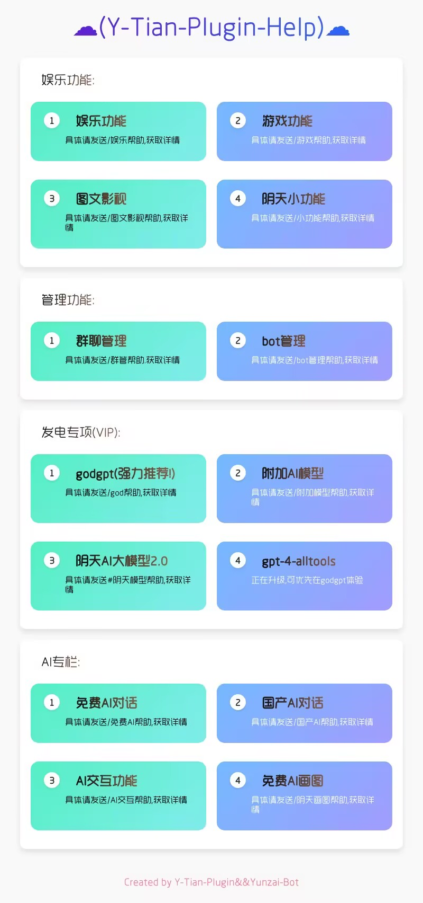
</details>

## 🤖 AI 模型功能概览

<details>
<summary>💬 对话类模型</summary>
<br>
🔹 <b>OpenAI</b>
&nbsp;&nbsp;✨ gpt-3.5-turbo
&nbsp;&nbsp;✨ gpt-3.5-turbo-0613
&nbsp;&nbsp;✨ gpt-3.5-turbo-instruct
&nbsp;&nbsp;✨ gpt-3.5-turbo-online
&nbsp;&nbsp;✨ gpt-3.5-turbo-1106
&nbsp;&nbsp;✨ gpt-3.5-turbo-0125
&nbsp;&nbsp;✨ gpt-3.5-turbo-16k
&nbsp;&nbsp;✨ gpt-3.5-turbo-16k-0613
&nbsp;&nbsp;✨ gpt-4
&nbsp;&nbsp;✨ gpt-4-0314
&nbsp;&nbsp;✨ gpt-4-0613
&nbsp;&nbsp;✨ gpt-4-32k
&nbsp;&nbsp;✨ gpt-4-32k-0613
&nbsp;&nbsp;✨ gpt-4-dalle
&nbsp;&nbsp;✨ gpt-4-vision
&nbsp;&nbsp;✨ gpt-4-1106-preview
&nbsp;&nbsp;✨ gpt-4-0125-preview
&nbsp;&nbsp;✨ gpt-4-turbo-2024-04-09
&nbsp;&nbsp;✨ gpt-4-turbo-preview
&nbsp;&nbsp;✨ gpt-4-all
&nbsp;&nbsp;✨ gpt-4-plugins
&nbsp;&nbsp;✨ gpt-4-gizmo
<br>
🔹 <b>Anthropic</b>
&nbsp;&nbsp;✨ claude-1-100k
&nbsp;&nbsp;✨ claude-1.3-100k
&nbsp;&nbsp;✨ claude-2
&nbsp;&nbsp;✨ claude-2-sillytavern
&nbsp;&nbsp;✨ claude-3-haiku
&nbsp;&nbsp;✨ claude-3-sonnect
&nbsp;&nbsp;✨ claude-3-opus
<br>
🔹 <b>Google</b>
&nbsp;&nbsp;✨ google-palm
&nbsp;&nbsp;✨ google-bard
&nbsp;&nbsp;✨ gemini-pro
&nbsp;&nbsp;✨ gemini-pro-vision
&nbsp;&nbsp;✨ gemma-2b-it
&nbsp;&nbsp;✨ gemma-7b-it
<br>
🔹 <b>Meta</b>
&nbsp;&nbsp;✨ llama-2-7b
&nbsp;&nbsp;✨ llama-2-13b
&nbsp;&nbsp;✨ llama-2-70b
&nbsp;&nbsp;✨ llama-3-8b
&nbsp;&nbsp;✨ llama-3-70b
&nbsp;&nbsp;✨ llama-3-sonar-small-32k-online
&nbsp;&nbsp;✨ llama-3-sonar-small-32k-chat
&nbsp;&nbsp;✨ llama-3-sonar-large-32k-online
&nbsp;&nbsp;✨ llama-3-sonar-large-32k-chat
&nbsp;&nbsp;✨ code-llama-7b
&nbsp;&nbsp;✨ code-llama-13b 
&nbsp;&nbsp;✨ code-llama-34b
&nbsp;&nbsp;✨ code-llama-70b-instruct
<br>
🔹 <b>ChatGLM</b>
&nbsp;&nbsp;✨ chatglm-pro
&nbsp;&nbsp;✨ chatglm-turbo
&nbsp;&nbsp;✨ chatglm-130b
&nbsp;&nbsp;✨ chatglm-3-turbo
&nbsp;&nbsp;✨ chatglm-4
&nbsp;&nbsp;✨ chatglm-4-v
&nbsp;&nbsp;✨ chatglm-4-alltools
<br>
🔹 <b>mixtral</b>
&nbsp;&nbsp;✨ mixtral-8x7b
&nbsp;&nbsp;✨ mixtral-8x22b
&nbsp;&nbsp;✨ mistral-34b
&nbsp;&nbsp;✨ mistral-7b-instruct
<br>
🔹 <b>360</b>
&nbsp;&nbsp;✨ 360-ai
&nbsp;&nbsp;✨ 360-search
<br>
🔹 <b>上海云影</b>
&nbsp;&nbsp;✨ llava-v1.6-34b
&nbsp;&nbsp;✨ llava-v1.5-7b-wrapper
<br>
🔹 <b>通义千问</b>
&nbsp;&nbsp;✨ qwen-72b
&nbsp;&nbsp;✨ qwen-alltools
<br>
🔹 <b>moonshot</b>
&nbsp;&nbsp;✨ moonshot-128k
&nbsp;&nbsp;✨ moonshot-alltools
<br>
🔹 <b>微软</b>
&nbsp;&nbsp;✨ github-copilot
&nbsp;&nbsp;✨ windows-copilot
<br>
🔹 <b>百度</b>
&nbsp;&nbsp;✨ wenxing-3.5
&nbsp;&nbsp;✨ baidu-search
<br>
🔹 <b>讯飞</b>
&nbsp;&nbsp;✨ xinghuo-v1/2/3
&nbsp;&nbsp;✨ xinghuo-alltools
<br>
🔹 <b>深度求索</b>
&nbsp;&nbsp;✨ deepseek-chat
&nbsp;&nbsp;✨ deepseek-code
<br>
🔹 <b>其他</b>
&nbsp;&nbsp;✨ webgpt
&nbsp;&nbsp;✨ yi-34b
&nbsp;&nbsp;✨ mj-chat
&nbsp;&nbsp;✨ baichuan-v3-alltools

</details>

<details>
<summary>🖼️ 文生图模型</summary>
<br>
🔹 <b>Stability AI</b>
&nbsp;&nbsp;✨ Stable Diffusion 系列
<br>
🔹 <b>Midjourney</b>
&nbsp;&nbsp;✨ Midjourney
<br>
🔹 <b>OpenAI</b>
&nbsp;&nbsp;✨ DALL-E 系列
<br>
🔹 <b>其他</b>
&nbsp;&nbsp;✨ ...

</details>

<details>
<summary>🔍 识图模型</summary>
<br>
🔹 <b>OCR</b>
&nbsp;&nbsp;✨ 文字识别
<br>
🔹 <b>OpenAI</b>
&nbsp;&nbsp;✨ gpt-4-v/all 等多模态 GPT 模型
<br>
🔹 <b>ChatGLM</b>  
&nbsp;&nbsp;✨ chatglm-4-alltools 等多功能模型
<br>
🔹 <b>MosaicML</b>
&nbsp;&nbsp;✨ gemini-pro-vision 等专业视觉模型
<br>
🔹 <b>其他</b>
&nbsp;&nbsp;✨ ...

</details>

<details>
<summary>🔊 语音模型</summary>
<br>
🔹 <b>虚拟偶像</b>
&nbsp;&nbsp;✨ 原神崩三等语音库
<br>  
🔹 <b>歌曲生成</b>
&nbsp;&nbsp;✨ Suno-V3
<br>  
🔹 <b>OpenAi</b>
&nbsp;&nbsp;✨ tts/tts-hd
</details>


## 🤖 AI功能展示

<details>
<summary> 🔷 示例1</summary>

### 🔷 免费Sess模型
<details>
<summary>点击查看</summary>
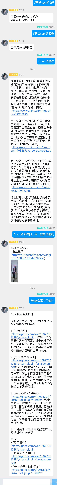
</details>

### 🔷 免费国产模型
<details>
<summary>点击查看</summary>
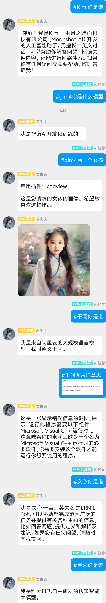
</details>

### 🔷 免费Dall-E绘图
<details>
<summary>点击查看</summary>
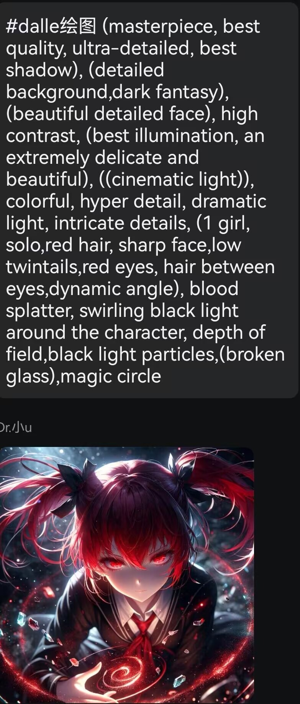
</details>

### 🔷 GPT-4多模态
<details>
<summary>点击查看</summary>

</details>

### 🔷 文生视频等
<details>
<summary>点击查看</summary>

</details>

### 🔷 TTS交互模型
<details>
<summary>点击查看</summary>

</details>
</details>

<details>
<summary> 💎 示例2</summary>

### 💎 GPT-4免费版
<details>
<summary>点击查看</summary>
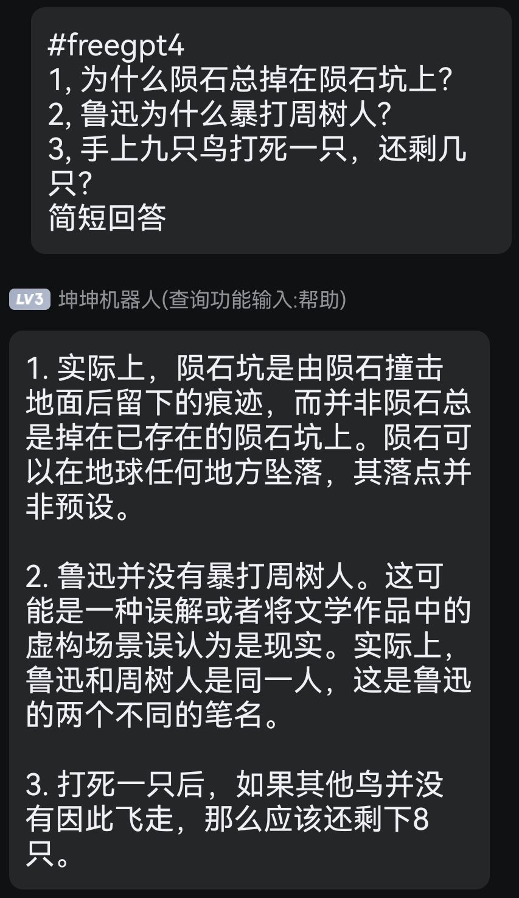
</details>

### 💎 月之暗面Web版
<details>
<summary>点击查看</summary>
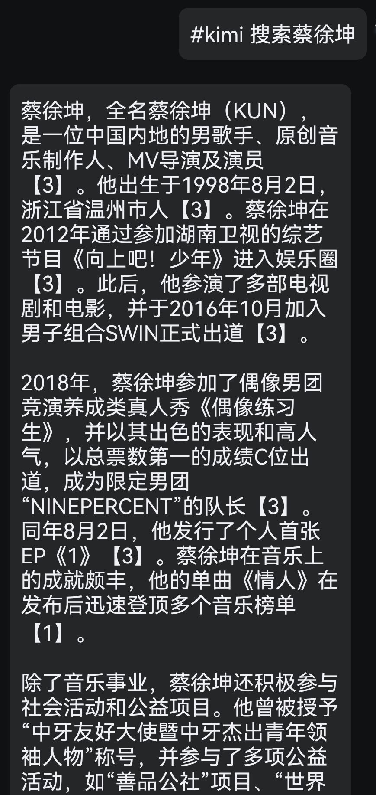
</details>

### 💎 星火模型Web版
<details>
<summary>点击查看</summary>
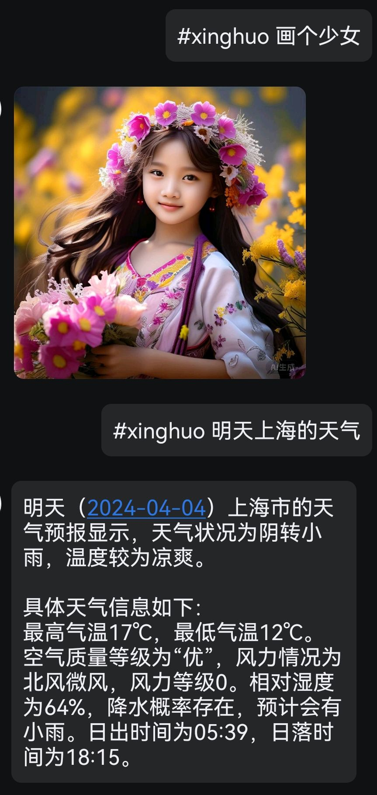
</details>

### 💎 智谱清言Web版 
<details>
<summary>点击查看</summary>
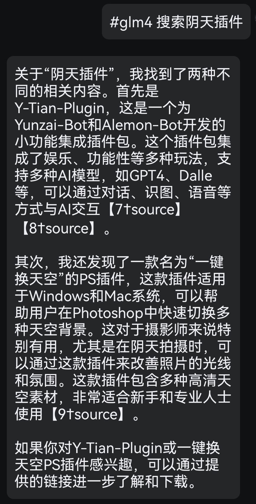

</details>

### 💎 微软Copilot
<details>
<summary>点击查看</summary>
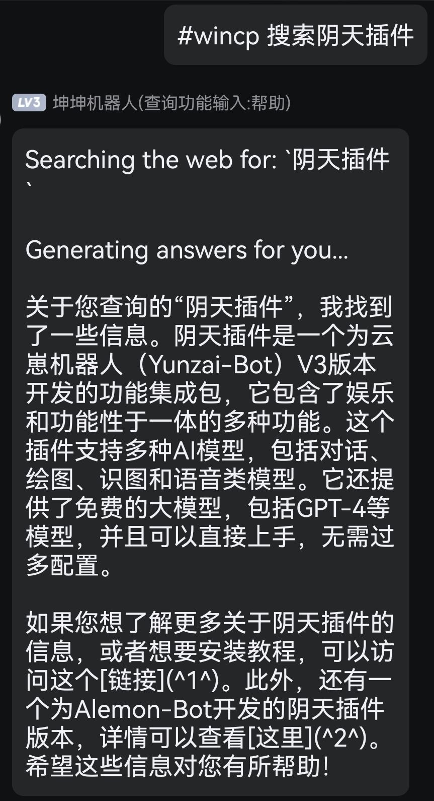


</details>

### 💎 通义千问Web版
<details>
<summary>点击查看</summary>


</details>

### 💎 ChatGPT Plus版
<details>
<summary>点击查看</summary>
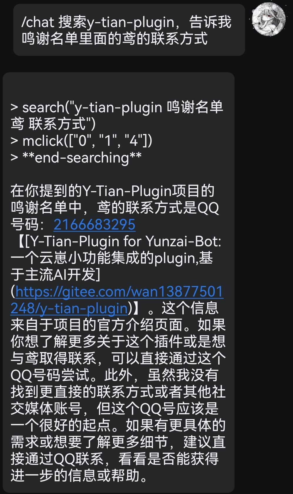


</details>
</details>

## 🔆 与AI交互流程

### 💻 对话交互
> 阴天帮助 → AI总帮助 → 打开At回复 → 选择启用方案 → 参考方案帮助

<details>
<summary>点击查看流程图</summary>
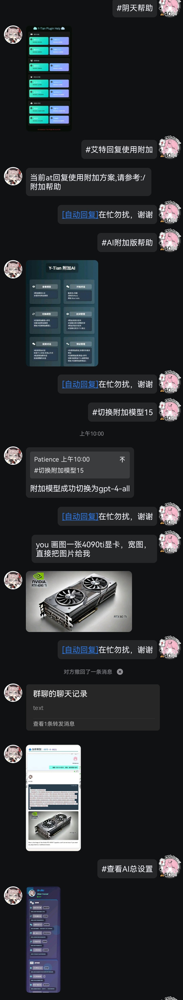
</details>

### 🖼️ 图片识别
<details>
<summary>点击查看流程图</summary>

</details>

### ⚙️ 使用预设
<details>
<summary>点击查看流程图</summary>

</details>

### 📄 文件处理
<details>
<summary>点击查看流程图</summary>
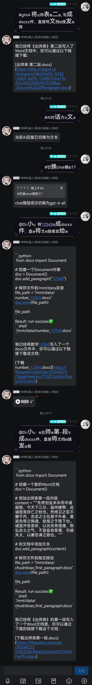
</details>

## 反馈与支持

如果您对本插件有任何意见或看法,欢迎通过以下渠道反馈:

### 💬 加入交流群

**[点击加入 Y-Tian 插件交流群](https://qm.qq.com/cgi-bin/qm/qr?_wv=1027&k=9-rRV1zBm0H3Es3V32FXSIJdR7v4hEjY&authKey=VvpBHKV%2FnjOxT0fPSagpTCIyJ91vNgvyc0CIt40%2BY1Q2kT%2BnUKjzLjbMtRVTh%2BqW&noverify=0&group_code=756783127)**

在这里,您可以与开发者和其他用户进行交流、提出问题、分享体验等。

### ⭐ 点赞支持

如果您喜欢我们的插件,欢迎在相关仓库给予 ⭐️ star,这将是我们前进的动力!

### 💰 赞助渠道

您也可以通过以下渠道对我们进行赞助支持:

[爱发电](https://afdian.net/a/yuan_20) 赞助用户将有机会提前体验本插件未公布的新功能。您的支持将成为我们持续更新的动力!

### 🙏 鸣谢

在此,我们向所有为本项目做出贡献的个人和组织表示衷心的感谢!

### ✨ 贡献者

[](#contributors-)

<table>
  <tbody>
    <tr>
      <td align="center" valign="top" width="14.28%"><a href="https://gitee.com/yuanpluss"><br /><sub><b>patience</b></sub></a><br /><a href="https://gitee.com/wan13877501248/y-tian-plugin/" title="编写主体">💻</a></td>
      <td align="center" valign="top" width="14.28%"><a href="https://gitee.com/wan13877501248"><br /><sub><b>天球生物</b></sub></a><br /><a href="https://gitee.com/wan13877501248/y-tian-plugin/" title="提供本体">💻</a></td>
      <td align="center" valign="top" width="14.28%"><a href="https://gitee.com/wan13877501248/y-tian-plugin/"><br /><sub><b>mr.k</b></sub></a><br /><a href="https://gitee.com/wan13877501248/y-tian-plugin/" title="美工设计">🎨</a></td>
  </tbody>
</table>

### 🚪 传送门

以下是本项目的相关链接资源:

- 💻 同款 Demo 网页 AI 对话: [Gitee](https://gitee.com/yuanpluss/simple-free-ai)
- 😺 喵喵版 Yunzai-Bot (V3): [Github](https://github.com/yoimiya-kokomi/Miao-Yunzai) / [Gitee](https://gitee.com/yoimiya-kokomi/Miao-Yunzai)
- ☁️ 阴天插件 Alemon-Bot 版: [Gitee](https://gitee.com/wan13877501248/y-tian-plugin-for-alemon-bot)
- 💻 个人 Windows 电脑一键部署: [Gitee](https://gitee.com/wan13877501248/yin-tian-tian-script-for-win)

> 📢 **严禁将本项目用于任何商业用途和非法行为!**