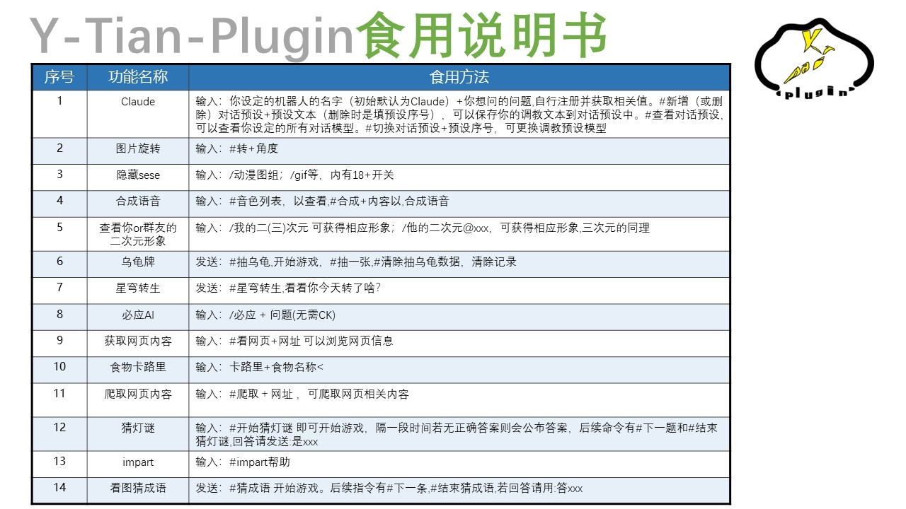
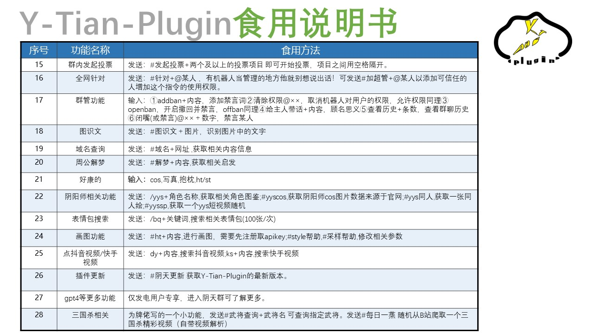

# Y-Tian-Plugin（阴天插件）

# ※使用本插件前一定要正确配置FFmpeg※

## 介绍
Y-Tian阴天插件，一个Yunzai-Bot V3小功能集成的插件包,集娱乐，功能性于一体，让你的机器人变得更为全面多功能。（进插件群解锁更多玩法！！！）

## 安装教程

在Yunzai-Bot根目录下，运行cmd，输入以下指令
```
git clone https://gitee.com/wan13877501248/y-tian-plugin.git ./plugins/y-tian-plugin/

```
## 功能一览

| 命令| 说明|
|:--------|------------|
| #阴天更新 | 更新阴天插件 |
| #阴天帮助 | 获取相关命令|

以下为Y-Tian-Plugin(阴天插件)详细功能介绍图以及链接：

   
   
  

您也可以点击我们的[**插件展示页**](https://shouquan-1315544562.cos.ap-nanjing.myqcloud.com/YT.html)，然后选择右上角的<功能展示>以查看阴天插件本体以及爱发电部分功能的使用记录截图。


## 反馈

如果你对本插件有任何意见或看法

可以使用QQ群组功能反馈。**点击加入[Y-Tian插件交流群](http://qm.qq.com/cgi-bin/qm/qr?_wv=1027&k=9-rRV1zBm0H3Es3V32FXSIJdR7v4hEjY&authKey=VvpBHKV%2FnjOxT0fPSagpTCIyJ91vNgvyc0CIt40%2BY1Q2kT%2BnUKjzLjbMtRVTh%2BqW&noverify=0&group_code=756783127)**。

如果你喜欢我们的插件，不妨给个star或者[爱发电](https://afdian.net/a/Tianqiu)，你的支持将是我们的动力，且发电用户有机会提前体验本插件未公布的的新功能。

### 鸣谢

| 名单     | 联系方式     | 主要贡献     |
| -------- | ------------ | ------------ |
| 天球生物 | QQ928368902 | 阴天插件部分功能编写，提供plugin本体，实现alemon移植工作等 |
| 鸢    | QQ2166683295 | 阴天插件大部分功能编写，官网撰写， 整合工作等|
| op要喝op果奶   | QQ715494637 | 阴天python机器人移植工作,实现discord插件移植|
| Mr.k   | QQ3302843718 | 阴天插件UI设计，美工 |

### 传送门

* Yunzai-Bot插件库：[☞Github](https://github.com/yhArcadia/Yunzai-Bot-plugins-index)/[☞Gitee](https://gitee.com/yhArcadia/Yunzai-Bot-plugins-index)
* Yunzai-Bot（V3）：[☞Github](https://github.com/Le-niao/Yunzai-Bot)/[☞Gitee](https://gitee.com/Le-niao/Yunzai-Bot) 
* Alemon-Bot：[☞官方文档](http://ningmengchongshui.gitee.io/lemonade) /[☞Gitee](https://gitee.com/ningmengchongshui/alemon-bot) 
* 阴天插件Alemon-Bot版本：[☞Gitee](https://gitee.com/wan13877501248/y-tian-plugin-for-alemon-bot) 
* 阴天个人windows电脑一键部署云崽脚本：[☞Gitee](https://gitee.com/wan13877501248/yin-tian-tian-script-for-win) 
* 严禁用于任何商业用途和非法行为


