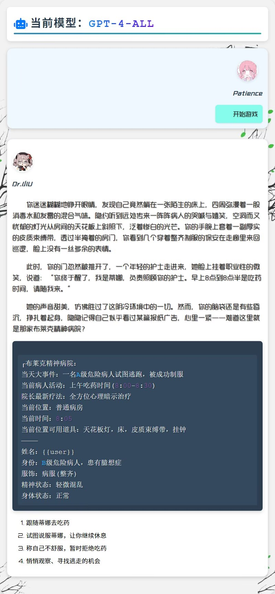
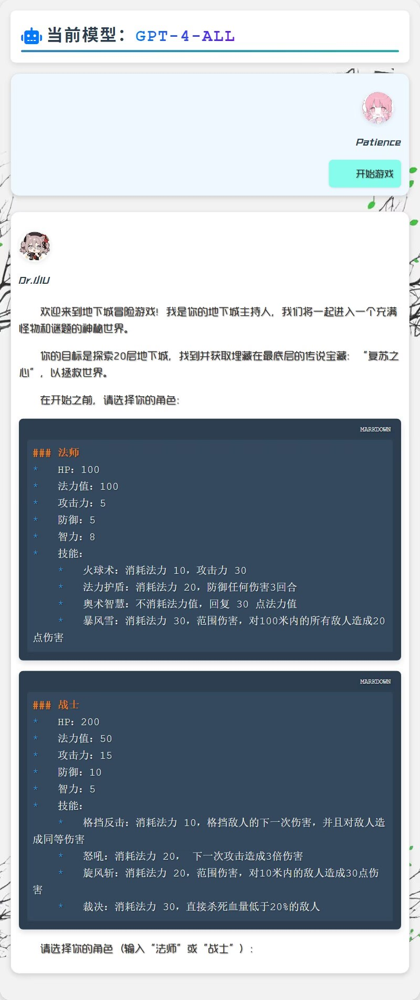

<div style="background-color: #111; color: #fff; padding: 30px; border-radius: 10px;">
  <div style="text-align: center; margin-bottom: 30px;">
    <a href="https://gitee.com/yuanpluss">
      
    </a>
  </div>

  <div style="display: flex; justify-content: center; margin-bottom: 30px;">
    
    
    
    
    
        <a href="https://www.murphysec.com/console/report/1718228587458985984/1718228588025217024" style="margin-right: 10px;">
      
    </a>
  </div>

  <h2 style="text-align: center; font-family: 'Courier New', monospace; letter-spacing: 2px;">😃 阴天插件索引页:</h2>

  <p style="text-align: center; font-size: 18px; font-family: 'Courier New', monospace;">
    <strong>使用插件在线免费Ai页(请使用pc端访问) <a href="https://yuanpluss.online:1111/"
    style="color: #0ff;">免费AI</a></strong><br>
  </p>

</div>

## ☁️ 插件简介

1. **🎯 插件宗旨** <br>

> Y-Tian-Plugin 是一款集成多种功能的 Yunzai-Bot V3 插件包。<br>通过集成多种 AI 模型与娱乐功能,使机器人更加多功能化。


> 旨在为用户提供免费AI模型供日常生活和学习,附加版/专业版/国产等方案集成百余个流行大模型,免费使用100+大模型(包括 GPT-4/4-all 等)。<br>小白可优先选择附加免费方案，集成gpt-4-all/claude-3.5-sonnet等强大模型，不限用量。 <br>
(PS: 非法用途如 黄色/暴力/涉政 等，本插件必要时会封禁用户 IP，望周知 !!! )

2. **🧠 AI模型支持** <br>
- 集成了如 **ChatGPT**、**Anthropic**、**ChatGLM**、**Gemini**、**Stable Diffusion**、**Midjourney**、**Suno**、**Pika** 、**Bing**、**Copilot**、**Cohere** 等多种主流 AI 模型
- 支持**文本生成**、**图像绘制**、**语音合成**、**AI作曲**、**文件处理**、**文件生成**等功能

3. **🎪 多功能集成** <br>
- 包括 **AI集成**、**娱乐**、**游戏**、**学习**、**影视**等多种功能
- 提供丰富的命令帮助,用户能够方便地调用各种功能

4. **💎 免费与高级功能** <br>
- 提供多种免费 AI 模型
- 也有高级功能可供赞助用户提前体验

## 📦 安装教程

在 Yunzai-Bot 根目录下，运行 cmd/git，输入以下指令:

### 1.(克隆仓库，任选一个即可)

*使用 Gitee (plugin, 最新)*
```shell
git clone --depth=1 https://gitee.com/wan13877501248/y-tian-plugin.git ./plugins/y-tian-plugin/
```

*使用 Gitee (plugin + V2工具箱, 测试中)*
```shell
git clone --branch V2 --single-branch https://gitee.com/wan13877501248/y-tian-plugin.git ./plugins/y-tian-plugin/
```

*使用 Github (plugin, 最新)*
```shell
git clone --depth=1 https://github.com/yuanplussfive/y-tian-plugin.git ./plugins/y-tian-plugin/
```

### 2.(安装依赖)

*进入插件目录*
```shell
cd plugins/y-tian-plugin
```

*安装依赖 (npm/pnpm/cnpm无所谓，国内环境推荐后两者)*
```shell
pnpm install
```

## 🚀 功能一览

<details>
<summary>阴天帮助一览</summary>

</details>

## 🤖 AI 模型功能概览

<details>
<summary>💬 对话类模型</summary>
<br>
🔹 <b>OpenAI</b>
&nbsp;&nbsp;✨ gpt-3.5-turbo
&nbsp;&nbsp;✨ gpt-3.5-turbo-0613
&nbsp;&nbsp;✨ gpt-3.5-turbo-instruct
&nbsp;&nbsp;✨ gpt-3.5-turbo-online
&nbsp;&nbsp;✨ gpt-3.5-turbo-1106
&nbsp;&nbsp;✨ gpt-3.5-turbo-0125
&nbsp;&nbsp;✨ gpt-3.5-turbo-16k
&nbsp;&nbsp;✨ gpt-3.5-turbo-16k-0613
&nbsp;&nbsp;✨ gpt-4
&nbsp;&nbsp;✨ gpt-4-0314
&nbsp;&nbsp;✨ gpt-4-0613
&nbsp;&nbsp;✨ gpt-4-32k
&nbsp;&nbsp;✨ gpt-4-32k-0613
&nbsp;&nbsp;✨ gpt-4-dalle
&nbsp;&nbsp;✨ gpt-4-vision
&nbsp;&nbsp;✨ gpt-4-1106-preview
&nbsp;&nbsp;✨ gpt-4-0125-preview
&nbsp;&nbsp;✨ gpt-4-turbo-2024-04-09
&nbsp;&nbsp;✨ gpt-4-turbo-preview
&nbsp;&nbsp;✨ gpt-4o
&nbsp;&nbsp;✨ gpt-4o-0513
&nbsp;&nbsp;✨ gpt-4o-0806
&nbsp;&nbsp;✨ gpt-4o-0903
&nbsp;&nbsp;✨ gpt-4o-latest
&nbsp;&nbsp;✨ gpt-4o-all
&nbsp;&nbsp;✨ gpt-4o-plus
&nbsp;&nbsp;✨ gpt-4-all
&nbsp;&nbsp;✨ gpt-4-plugins
&nbsp;&nbsp;✨ gpt-4-gizmo
&nbsp;&nbsp;✨ o1-mini
&nbsp;&nbsp;✨ o1-mini-20240912
&nbsp;&nbsp;✨ o1-mini-all
&nbsp;&nbsp;✨ o1-preview
&nbsp;&nbsp;✨ o1-preview-20240912
&nbsp;&nbsp;✨ o1-preview-all
<br>
🔹 <b>Anthropic</b>
&nbsp;&nbsp;✨ claude-1-100k
&nbsp;&nbsp;✨ claude-1.3-100k
&nbsp;&nbsp;✨ claude-2
&nbsp;&nbsp;✨ claude-2-sillytavern
&nbsp;&nbsp;✨ claude-3-haiku
&nbsp;&nbsp;✨ claude-3-sonnect
&nbsp;&nbsp;✨ claude-3-opus
&nbsp;&nbsp;✨ claude-3.5-sonnet-0620
<br>
🔹 <b>Google</b>
&nbsp;&nbsp;✨ google-palm
&nbsp;&nbsp;✨ google-bard
&nbsp;&nbsp;✨ gemini-pro
&nbsp;&nbsp;✨ gemini-pro-vision
&nbsp;&nbsp;✨ gemini-1.5-pro-latest
&nbsp;&nbsp;✨ gemini-1.5-flash-latest
&nbsp;&nbsp;✨ gemma-2b-it
&nbsp;&nbsp;✨ gemma-7b-it
&nbsp;&nbsp;✨ gemma-2-7b-it
&nbsp;&nbsp;✨ gemma-2-27b-it
<br>
🔹 <b>Meta</b>
&nbsp;&nbsp;✨ llama-2-7b
&nbsp;&nbsp;✨ llama-2-13b
&nbsp;&nbsp;✨ llama-2-70b
&nbsp;&nbsp;✨ llama-3-8b
&nbsp;&nbsp;✨ llama-3-70b
&nbsp;&nbsp;✨ llama-3-sonar-small-32k-online
&nbsp;&nbsp;✨ llama-3-sonar-small-32k-chat
&nbsp;&nbsp;✨ llama-3-sonar-large-32k-online
&nbsp;&nbsp;✨ llama-3-sonar-large-32k-chat
&nbsp;&nbsp;✨ code-llama-7b
&nbsp;&nbsp;✨ code-llama-13b
&nbsp;&nbsp;✨ code-llama-34b
&nbsp;&nbsp;✨ code-llama-70b-instruct
&nbsp;&nbsp;✨ llama-3-7b
&nbsp;&nbsp;✨ llama-3-70b
&nbsp;&nbsp;✨ llama-3-405b
<br>
🔹 <b>ChatGLM</b>
&nbsp;&nbsp;✨ glm-pro
&nbsp;&nbsp;✨ glm-turbo
&nbsp;&nbsp;✨ glm-130b
&nbsp;&nbsp;✨ glm-3-turbo
&nbsp;&nbsp;✨ glm-4
&nbsp;&nbsp;✨ glm-4-v
&nbsp;&nbsp;✨ glm-4-alltools
&nbsp;&nbsp;✨ glm-4-0520
&nbsp;&nbsp;✨ glm-4-flash
&nbsp;&nbsp;✨ glm-4-air-0520
&nbsp;&nbsp;✨ glm-4-plus
<br>
🔹 <b>mixtral</b>
&nbsp;&nbsp;✨ mixtral-8x7b
&nbsp;&nbsp;✨ mixtral-8x22b
&nbsp;&nbsp;✨ mixtral-medium
&nbsp;&nbsp;✨ mistral-34b
&nbsp;&nbsp;✨ mistral-7b-instruct
<br>
🔹 <b>Reka</b>
&nbsp;&nbsp;✨ reka-core
&nbsp;&nbsp;✨ reka-flash
&nbsp;&nbsp;✨ reka-edge
<br>
🔹 <b>360智脑</b>
&nbsp;&nbsp;✨ 360-ai
&nbsp;&nbsp;✨ 360-search
<br>
🔹 <b>通义千问</b>
&nbsp;&nbsp;✨ qwen-72b
&nbsp;&nbsp;✨ qwen-alltools
<br>
🔹 <b>月之暗面</b>
&nbsp;&nbsp;✨ moonshot-v1-8k
&nbsp;&nbsp;✨ moonshot-v1-32k
&nbsp;&nbsp;✨ moonshot-v1-128k
&nbsp;&nbsp;✨ moonshot-alltools
<br>
🔹 <b>字节跳动</b>
&nbsp;&nbsp;✨ doubao-lite
&nbsp;&nbsp;✨ doubao-all
&nbsp;&nbsp;✨ doubao-32k
&nbsp;&nbsp;✨ coze-assistent-all
&nbsp;&nbsp;✨ coze-gpt-4-all
<br>
🔹 <b>Microsoft</b>
&nbsp;&nbsp;✨ github-copilot
&nbsp;&nbsp;✨ windows-copilot
&nbsp;&nbsp;✨ Bing-Balanced
&nbsp;&nbsp;✨ Bing-Practice
&nbsp;&nbsp;✨ Bing-Creative
&nbsp;&nbsp;✨ Bing-gpt-4-turbo
<br>
🔹 <b>百度千帆</b>
&nbsp;&nbsp;✨ baidu-search
&nbsp;&nbsp;✨ ERNIE-Bot-lite
&nbsp;&nbsp;✨ ERNIE-Bot-3.5
&nbsp;&nbsp;✨ ERNIE-Bot-4.0
<br>
🔹 <b>讯飞星火</b>
&nbsp;&nbsp;✨ spark-desk-v1.5
&nbsp;&nbsp;✨ spark-desk-v2.0
&nbsp;&nbsp;✨ spark-desk-v3.0
&nbsp;&nbsp;✨ spark-desk-v3.5
&nbsp;&nbsp;✨ spark-desk-v4.0
&nbsp;&nbsp;✨ spark-desk-alltools
<br>
🔹 <b>深度求索</b>
&nbsp;&nbsp;✨ deepseek-chat
&nbsp;&nbsp;✨ deepseek-code
&nbsp;&nbsp;✨ deepseek-V2-chat
&nbsp;&nbsp;✨ deepseek-V2-code
<br>
🔹 <b>零一万物</b>
&nbsp;&nbsp;✨ yi-34b
&nbsp;&nbsp;✨ yi-34b-chat-200k
&nbsp;&nbsp;✨ yi-V1-32k
&nbsp;&nbsp;✨ yi-V2-128k
<br>
🔹 <b>百川智能</b>
&nbsp;&nbsp;✨ baichuan-v3-53b
&nbsp;&nbsp;✨ baichuan-v3-alltools
&nbsp;&nbsp;✨ baichuan-v4-plus
<br>
🔹 <b>其他模型</b>
&nbsp;&nbsp;✨ webgpt
&nbsp;&nbsp;✨ mj-chat
&nbsp;&nbsp;✨ coze-gpt-4-all
&nbsp;&nbsp;✨ reka-flash
&nbsp;&nbsp;✨ command-r-plus
&nbsp;&nbsp;✨ Atom-13B-Chat
&nbsp;&nbsp;✨ Minimax-hailuo
&nbsp;&nbsp;✨ step-1-200k
&nbsp;&nbsp;✨ hunyuan-alltools
&nbsp;&nbsp;✨ ......
</details>

<details>
<summary>🖼️ 文生图模型</summary>
<br>
🔹 <b>Stability</b>
&nbsp;&nbsp;✨ Stable Diffusion 系列
<br>
🔹 <b>Flux</b>
&nbsp;&nbsp;✨ Flux 系列
<br>
🔹 <b>PixArt</b>
&nbsp;&nbsp;✨ pixart 系列
<br>
🔹 <b>Midjourney</b>
&nbsp;&nbsp;✨ Midjourney/Niji 系列
<br>
🔹 <b>OpenAI</b>
&nbsp;&nbsp;✨ DALL-E 系列
<br>
🔹 <b>其他</b>
&nbsp;&nbsp;✨ Stable Cascade, dream...

</details>

<details>
<summary>🔍 识图模型</summary>
<br>
🔹 <b>OCR</b>
&nbsp;&nbsp;✨ 文字识别
<br>
🔹 <b>OpenAI</b>
&nbsp;&nbsp;✨ gpt-4-v/all 系列多模态 GPT 模型
<br>
🔹 <b>ChatGLM</b>
&nbsp;&nbsp;✨ glm-4-alltools 系列多功能模型
<br>
🔹 <b>Google</b>
&nbsp;&nbsp;✨ gemini-pro-vision 系列专业视觉模型
<br>
🔹 <b>其他</b>
&nbsp;&nbsp;✨ ...

</details>

<details>
<summary>🔊 语音模型</summary>
<br>
🔹 <b>虚拟偶像</b>
&nbsp;&nbsp;✨ 原神崩三等语音
&nbsp;&nbsp;✨ Fish-vits语音
<br>
🔹 <b>歌曲生成</b>
&nbsp;&nbsp;✨ Suno-V3
&nbsp;&nbsp;✨ Suno-V3.5
<br>
🔹 <b>OpenAi</b>
&nbsp;&nbsp;✨ tts/tts-1-hd...
</details>

## 🤖 常用的基本设置

<details>
<summary> 💎 方案区间设置：</summary>

#### 🔷 开启分区间(个人独立对话)
**<summary>#xx开启分区间</summary>**
**<summary>#切换xx预设xx</summary>**

#### 🔷 关闭分区间(群聊共享对话)
**<summary>#xx关闭分区间</summary>**
**<summary>#切换xx预设xx</summary>**
</details>

</details>

<details>
<summary> 💎 图片对话渲染方式：</summary>

### 🔷 使用mathjax(擅长渲染数学公式，精准)
<details>
<summary>示例1</summary>

</details>
<details>
<summary>示例2</summary>

</details>

### 🔷 使用markdown(擅长渲染代码块，高亮)
<details>
<summary>示例1</summary>

</details>
<details>
<summary>示例2</summary>

</details>
<details>
<summary>示例3</summary>

</details>
<details>
<summary>示例4</summary>

</details>
</details>

<details>
<summary> 💎 tts语音回复：</summary>

### 🔷 先开启tts回复
<details>
<summary>示例</summary>

</details>

### 🔷 查看tts音色
<details>
<summary>示例</summary>

</details>

### 🔷 选择tts音色
<details>
<summary>示例</summary>

</details>
</details>

## 🤖 AI功能展示

<details>
<summary> 💎 多模态部分模型功能展示：</summary>

### 🔷 文件处理和生成
<details>
<summary>文件生成</summary>

</details>
<details>
<summary>文件处理</summary>

</details>

### 🔷 Plus dalle绘图
<details>
<summary>dalle文生图</summary>

</details>
<details>
<summary>dalle图生图</summary>

</details>

### 🔷 深度联网搜索
<details>
<summary>信息检索</summary>

</details>
<details>
<summary>检索生成</summary>

</details>

### 🔷 图像检索识别
<details>
<summary>图片检索</summary>

</details>
<details>
<summary>图片分析</summary>

</details>
</details>

<details>
<summary> 💎 国产部分模型功能展示</summary>

### 💎 月之暗面Web版
<details>
<summary>点击查看</summary>

</details>

### 💎 星火模型Web版
<details>
<summary>点击查看</summary>

</details>

### 💎 智谱清言Web版
<details>
<summary>点击查看</summary>

</details>

### 💎 百川智能Web版
<details>
<summary>点击查看</summary>


</details>

### 💎 微软Copilot
<details>
<summary>点击查看</summary>


</details>

### 💎 通义千问Web版
<details>
<summary>点击查看</summary>


</details>

### 💎 DeepSeekWeb版
<details>
<summary>点击查看</summary>

</details>
</details>

## 🔆 与AI交互流程

### 💻 对话交互
> 阴天帮助 → AI总帮助 → 打开At回复 → 选择启用方案 → 参考方案帮助(小白授权后可免费使用附加模型，推荐使用此方案)

<details>
<summary>点击查看流程图</summary>

</details>

## 反馈与支持

如果您对本插件有任何意见或看法,欢迎通过以下渠道反馈:

### 💬 一起交流

**[点击加入 Y-Tian 插件交流群(授权免费附加模型)](http://qm.qq.com/cgi-bin/qm/qr?_wv=1027&k=jZAmTxqiEMP_hDTQOH4yaU-VgIuezmAQ&authKey=C3gEwvelMi3MKAdU87muZmN11eg3ewtIRvbjupFAZtEZoPwKRa6Rii1fmKD85iUw&noverify=0&group_code=912701273)**

在这里,您可以与开发者和其他用户进行交流、提出问题、分享体验等。

### ⭐ Star支持

如果您喜欢我们的插件,欢迎在相关仓库给予 ⭐️ star,这将是我们前进的动力!

### 💰 赞助渠道

您也可以通过以下渠道对我们进行赞助支持:

[爱发电](https://afdian.com/a/yuan_20) 赞助用户将有机会提前体验本插件未公布的新功能。您的支持将成为我们持续更新的动力!

### ✨ 贡献成员

[](#contributors-)

<a href="https://github.com/yuanplussfive/y-tian-plugin/graphs/contributors">
  
</a>


### 🚪 传送门

以下是本项目的相关链接资源:

- ☁️ 阴天插件 Yunzai-Bot 版: [Github](https://github.com/yuanplussfive/y-tian-plugin) / [Gitee](https://gitee.com/wan1387501248/y-tian-plugin)
- ☁️ 阴天插件 Alemon-Bot 版: [Gitee](https://gitee.com/wan13877501248/y-tian-plugin-for-alemon-bot)
- 😺 喵喵版 Yunzai-Bot (V3): [Github](https://github.com/yoimiya-kokomi/Miao-Yunzai) / [Gitee](https://gitee.com/yoimiya-kokomi/Miao-Yunzai)
- 💻 同款 Demo 网页 AI 对话1: [Gitee](https://gitee.com/yuanpluss/simple-free-ai)
- 💻 同款 Demo 网页 AI 对话2: [Gitee](https://gitee.com/yuanpluss/demo-chatai)
- 💻 个人 Windows 电脑一键部署: [Gitee](https://gitee.com/wan13877501248/yin-tian-tian-script-for-win)

### 🙏 鸣谢

在此,我们向所有为本项目做出贡献的个人和组织以及爱发电赞助成员表示衷心的感谢!如有任何问题或反馈,欢迎通过以下方式联系我们:

- 邮箱: email@yuanoop.com
- 交流群: **[插件交流群](http://qm.qq.com/cgi-bin/qm/qr?_wv=1027&k=jZAmTxqiEMP_hDTQOH4yaU-VgIuezmAQ&authKey=C3gEwvelMi3MKAdU87muZmN11eg3ewtIRvbjupFAZtEZoPwKRa6Rii1fmKD85iUw&noverify=0&group_code=912701273)**

> 📢 **严禁将本项目用于任何商业用途和非法行为!**