<div style="background-color: #1e1e1e; color: #ffffff; padding: 30px; border-radius: 12px; font-family: 'Segoe UI', Tahoma, Geneva, Verdana, sans-serif;">
  
  <div style="text-align: center; margin-bottom: 30px;">
    <a href="https://gitee.com/yuanpluss">
      
    </a>
  </div>

  <div style="display: flex; justify-content: center; gap: 15px; margin-bottom: 30px;">
    <a href="https://gitee.com/wan13877501248/y-tian-plugin">
      
    </a>
    <a href="https://gitee.com/wan13877501248/y-tian-plugin">
      
    </a>
    
    
    
    <a href="https://www.murphysec.com/console/report/1718228587458985984/1718228588025217024" style="display: block; width: 100%;">
    
   </a>
  </div>

  <h1 style="text-align: center; font-family: 'Courier New', monospace; letter-spacing: 2px;">😃 阴天插件索引页</h1>

  <p style="text-align: center; font-size: 18px; font-family: 'Courier New', monospace;">
    <strong>在线平台
      <a href="https://yuanplus.chat/" style="color: #00ffff;">AI</a>
    </strong>
  </p>

</div>

## ☁️ 插件简介

### 🌟 明灯

🌅 最初，我们握着一盏明灯  
想要照亮他人前路  
深信AI红利不该被垄断  
每个追梦者都该有机会触碰这改变世界的技术

### 🌱 历程
- 倾注时光与心血
- 搭建免费服务平台
- 目睹用户不断涌入
- 收获感激与称赚

### 🎯 插件宗旨

> **Y-Tian-Plugin** 是一款集成多种功能的 **Yunzai-Bot V3** 插件包。通过整合多种 AI 模型与娱乐功能，提升机器人多功能性。  
> 致力于为用户提供免费AI模型，支持日常生活和学习，提供附加版、专业版及国产方案，集成百余个流行大模型，免费使用100+大模型（包括 GPT-4/4-all 等）。  
> **注意：** 非法用途（如色情、暴力、涉政等）将导致用户IP封禁，敬请理解！

> 📢 **本项目Ai大多数均为免费公益，切勿被骗！**
> 📢 **阴天提供的综合免费方案为，附加方案！**

### 🧠 AI模型支持

- **ChatGPT**、**Anthropic**、**ChatGLM**、**Gemini**、**Stable Diffusion**、**Midjourney**、**Suno**、**Pika**、**Bing**、**Copilot**、**Cohere** 等主流 AI 模型
- 支持 **文本生成**、**图像绘制**、**语音合成**、**AI作曲**、**文件处理**、**文件生成** 等功能

### 🎪 多功能集成

- **AI集成**、**娱乐**、**游戏**、**学习**、**影视** 等多种功能
- 丰富的命令帮助，方便用户调用各类功能

### 💎 免费与高级功能

- 提供多种免费 AI 模型
- 高级功能供赞助用户提前体验

## 📦 安装教程

在 **Yunzai-Bot** 根目录下，运行命令行工具，输入以下指令：

### 1. 克隆仓库（任选其一）

- **使用 Gitee (plugin, 最新)**
  ```shell
  git clone --depth=1 https://gitee.com/wan13877501248/y-tian-plugin.git ./plugins/y-tian-plugin/
  ```

- **使用 Gitee (plugin + V2工具箱, 测试中)**
  ```shell
  git clone --branch V2 --single-branch https://gitee.com/wan13877501248/y-tian-plugin.git ./plugins/y-tian-plugin/
  ```

- **使用 Github (plugin, 最新)**
  ```shell
  git clone --depth=1 https://github.com/yuanplussfive/y-tian-plugin.git ./plugins/y-tian-plugin/
  ```

### 2. 安装依赖

- **进入插件目录**
  ```shell
  cd plugins/y-tian-plugin
  ```

- **安装依赖** (推荐国内环境使用 `pnpm` 或 `cnpm`)
  ```shell
  pnpm install
  ```

### 能不能在其它场景调用插件免费api？--可以

 API 端点:

```
 https://yuanpluss.online:3000/api/v1/chat/completions
```

请求参数需要通过 `JSON` 格式的请求体传递。主要参数如下:

- `model`: 要使用的模型ID，例如 `gpt-4`。
- `messages`: 包含对话消息的数组，每个消息是一个对象,包含 `role` 和 `content` 属性。
- `temperature`: 采样温度,介于 0 和 2 之间,值越高生成内容越随机。
- `top_p`: 替代温度采样的方法,仅考虑构成前 `top_p` 概率质量的标记。
- `n`: 为每个输入消息生成的补全数量。
- `stream`: 是否以增量方式返回结果。
- `stop`: 最多4个序列,API将停止进一步生成标记。
- `max_tokens`: 生成的最大标记数。
- `presence_penalty`: 根据到目前为止是否出现在文本中来惩罚新标记。
- `frequency_penalty`: 根据文本目前的存在频率惩罚新标记。
- `logit_bias`: 修改指定标记出现在补全中的可能性。
- `user`: 代表最终用户的唯一标识符。

#### 示例代码

以下是使用 JavaScript 发送请求的示例代码:(密钥授权后免费获取)

```javascript
var myHeaders = new Headers();
myHeaders.append("Accept", "application/json");
myHeaders.append("Authorization", "Bearer {{YOUR_API_KEY}}");
myHeaders.append("User-Agent", "Apifox/1.0.0 (https://apifox.com)");
myHeaders.append("Content-Type", "application/json");

var raw = JSON.stringify([
   {
      "role": "user",
      "text": "你好"
   }
]);

var requestOptions = {
   method: 'POST',
   headers: myHeaders,
   body: raw,
   redirect: 'follow'
};

fetch("https://yuanpluss.online:3000/api/v1/chat/completions", requestOptions)
   .then(response => response.text())
   .then(result => console.log(result))
   .catch(error => console.log('error', error));
```

<details>
  <summary>🤖 Postman调试</summary>
  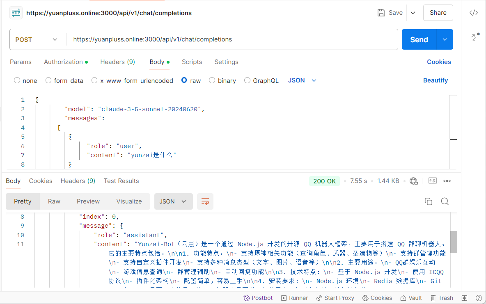
</details>

## 🚀 功能一览

<details>
  <summary>🔍 阴天帮助</summary>
  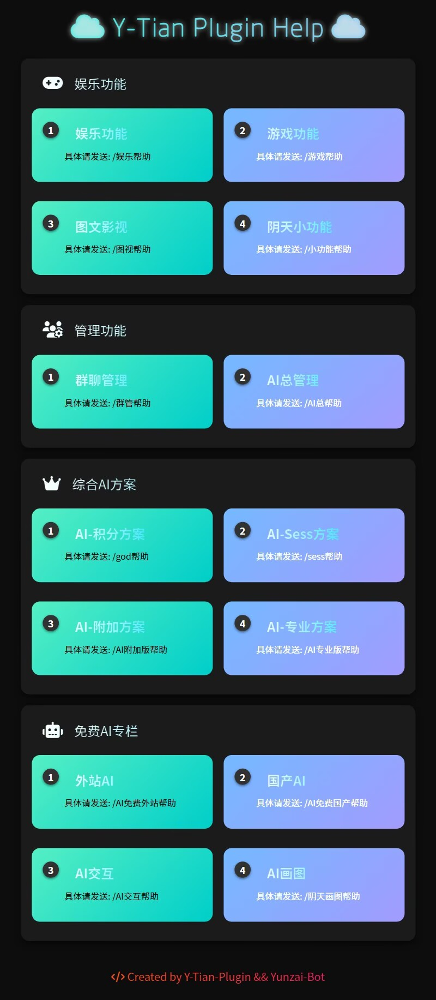
</details>


<details>
  <summary>🔍 常用帮助</summary>
  
  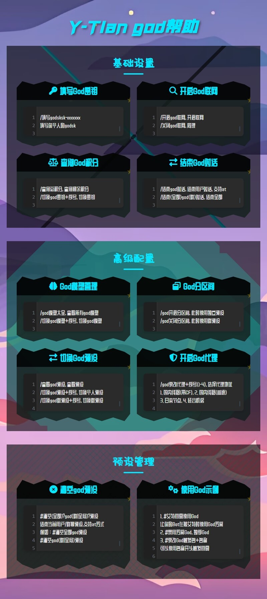
  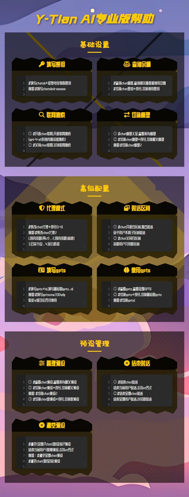
  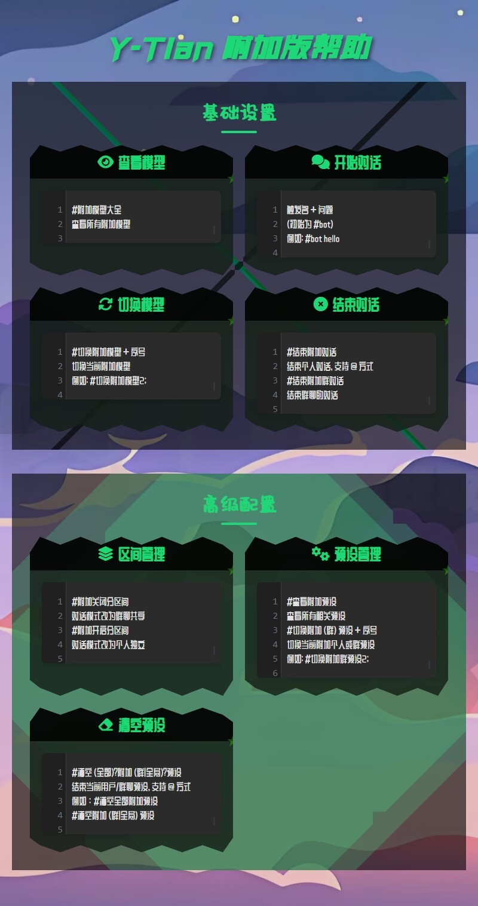
</details>

## 🤖 AI 模型功能概览

### 💬 对话类模型

#### 🌐 **OpenAI**

| 模型名称 | 功能描述 |
|----------|------|
| gpt-3.5-turbo | 基础对话模型 |
| gpt-4o-mini | 轻量版GPT4，优化响应速度 |
| gpt-4 | 高级对话模型，支持更复杂任务 |
| gpt-4-32k | 扩展上下文长度，适合长文档处理 |
| gpt-4-vision | 支持图像输入的对话模型 |
| gpt-4-dalle | 结合了GPT4和DALL-E的模型，能够理解和生成创意图像。 |
| gpt-4-all | 多功能版GPT4模型，集成了多种处理能力：**联网**、**识图**、**绘图**、**文件分析**、**代码解释器** |
| gpt-4o-all | 多功能版GPT4模型，集成了多种处理能力：**联网**、**识图**、**绘图**、**文件分析**、**代码解释器** |
| gpt-4-gizmo | GPT4的一种变体，专注于特定应用场景，可以使用所有gpts的插件，集成了多种处理能力：**联网**、**识图**、**绘图**、**文件分析**、**代码解释器** |
| o1-mini-all | 官网 plus 版本，有思考过程显示，o1-mini 是一个快速、高性价比的推理模型，专为编码、数学和科学用例而设计。该模型具有 128K 的上下文和最新的数据库. |
| o1-preview-all | 官网 plus 版本，有思考过程显示，o1-preview 是OpenAI针对复杂任务的新推理模型，常用于处理复杂任务。该模型具有 128K 上下文和最新的数据库. |
| ... | ... |

#### 🧠 **Anthropic**

| 模型名称 | 功能描述 |
|----------|------|
| claude-3-haiku-20240307 | Claude模型V3系列的轻量版本，具有最快的响应速度 |
| claude-3-opus-20240229 | Claude模型的最新版本，具有最先进的语言处理技术 |
| claude-3-5-sonnet-20240620 | Claude模型的最新版本,比opus还强，更廉价，具有最先进的语言处理技术 |
| ... | ... |

#### 🔍 **Google**

| 模型名称 | 功能描述 |
|----------|------|
| gemini-pro | Google高级人工智能模型，提供更复杂的语言理解和生成能力 |
| gemini-pro-vision | Google高级人工智能模型，支持图像识别 |
| gemini-1.5-pro | Google高级人工智能模型，复杂的推理任务，例如代码和文本生成、文本编辑、问题解决、数据提取和生成，支持图像识别 |
| gemini-1.5-flash | Google高级人工智能模型，轻量版本，支持图像识别 |
| ... | ... |

#### 🔍 **Bing**

| 模型名称 | 功能描述 |
|----------|------|
| Bing-Creative | 必应创造模式，擅长发散 |
| Bing-Practice | 必应严谨模式，严谨思考 |
| Bing-Balanced | 必应平衡模式，均衡作答 |
| ... | ... |

#### 🦾 **Meta**

| 模型名称 | 功能描述 |
|----------|------|
| llama-2-7b | 轻量级语言模型 |
| llama-3-sonar-large-32k-chat | 大型聊天模型，支持长上下文 |
| code-llama-70b-instruct | 专注于代码生成与理解 |
| ... | ... |

#### 🤖 **ChatGLM**

| 模型名称 | 功能描述 |
|----------|------|
| glm-4 | 智谱AI通用大模型，提供了更强大的问答和文本生成能力。适合于复杂的对话交互和深度内容创作设计的场景。 |
| glm-4v | 智谱AI通用大模型，实现了视觉语言特征的深度融合，支持视觉问答、图像字幕、视觉定位、复杂目标检测等各类图像理解任务。 |
| glm-4-alltools | 集成多种工具的ChatGLM |
| glm-4-plus | 能力强化的ChatGLM |
| ... | ... |

#### 🌟 **Mixtral**

| 模型名称 | 功能描述 |
|----------|------|
| mixtral-8x7b | 中型Mixtral模型 |
| mistral-34b | 大型Mixtral模型，适合复杂任务 |
| ... | ... |

#### ⚙️ **其他模型**

| 模型名称 | 功能描述 |
|----------|------|
| webgpt | 适用于网页内容处理生成 |
| mj-chat | Midjourney结合gpt4的对话生图模型 |
| deepseek-chat | 中文综合能力（AlignBench）开源模型中最强与 GPT-4-Turbo，文心 4.0 等闭源模型在评测中处于同一梯队 Chat专用 |
| ... | ... |

### 🖼️ 文生图模型

#### 🎨 **Stability**

- **Stable Diffusion 系列**
  - 高质量图像生成
  - 多种风格支持

#### 🌈 **Flux**

- **Flux 系列**
  - 快速图像生成
  - 灵活的风格调整

#### 🎨 **playground**

- **playground-v2/3 系列**
  - 高质量图像生成
  - 多种风格支持

#### 🖌️ **PixArt**

- **PixArt 系列**
  - 艺术风格图像生成
  - 支持多种艺术流派

#### 🌌 **Midjourney**

- **Midjourney/Niji 系列**
  - 高度详细的图像生成
  - 多种风格支持

#### 🖍️ **OpenAI**

- **DALL-E 系列**
  - 创意图像生成
  - 支持图生图

#### 🌈 **ideogram**

- **ideogram-V2 系列**
  - 快速图像生成
  - 擅长艺术风格

#### 🖼️ **其他**

- **Stable Cascade**, **dream...** 等

### 🔍 识图模型

#### 📝 **OCR**

- **文字识别**
  - 高精度文字提取
  - 支持多语言

#### 🌐 **OpenAI**

- **gpt-4-v/all 系列多模态 GPT 模型**
  - 支持图像与文本混合输入
  - 强大的理解与生成能力

#### 🤖 **ChatGLM**

- **glm-4-alltools 系列多功能模型**
  - 集成多种工具
  - 支持图像分析

#### 🔍 **Google**

- **gemini-pro-vision 系列专业视觉模型**
  - 高级图像识别
  - 专业应用支持

#### 🖼️ **其他**

- ...

### 🔊 语音模型

#### 🎤 **虚拟偶像**

- **原神崩三等语音**
- **Fish-vits语音**

#### 🎵 **歌曲生成**

- **Suno-V3**
- **Suno-V3.5**

#### 🗣️ **OpenAI**

- **tts/tts-1-hd...**

### 🎥 视频模型

#### 📹 **Runway**
#### 🎬 **Vidu**
#### 📺 **Luma**

## 🤖 常用的基本设置

### 💎 方案区间设置

<details>
  <summary>🔷 开启分区间 (个人独立对话)</summary>
  
  **命令示例：**
  - `#xx开启分区间`
  - `#切换xx预设xx`
</details>

<details>
  <summary>🔷 关闭分区间 (群聊共享对话)</summary>
  
  **命令示例：**
  - `#xx关闭分区间`
  - `#切换xx预设xx`
</details>

### 💎 图片对话渲染方式

#### 🔷 使用 MathJax (擅长渲染数学公式，精准)

<details>
  <summary>示例1</summary>
  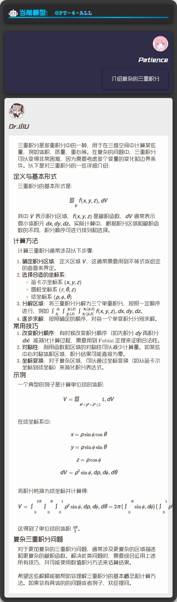
</details>

<details>
  <summary>示例2</summary>
  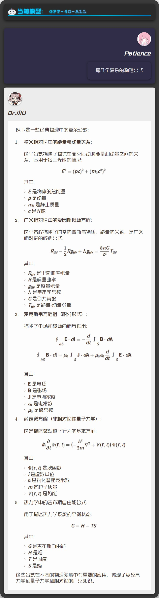
</details>

#### 🔷 使用 Markdown (擅长渲染代码块，高亮)

<details>
  <summary>示例1</summary>
  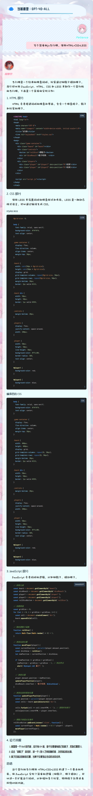
</details>

<details>
  <summary>示例2</summary>
  
</details>

### 💎 TTS语音回复

#### 🔷 先开启 TTS 回复

<details>
  <summary>示例</summary>
  
</details>

#### 🔷 查看 TTS 音色

<details>
  <summary>示例</summary>
  
</details>

#### 🔷 选择 TTS 音色

<details>
  <summary>示例</summary>
  
</details>

## 🤖 AI功能展示

### 💎 多模态部分模型功能展示

#### 📄 文件处理和生成

<details>
  <summary>📄 文件生成</summary>
  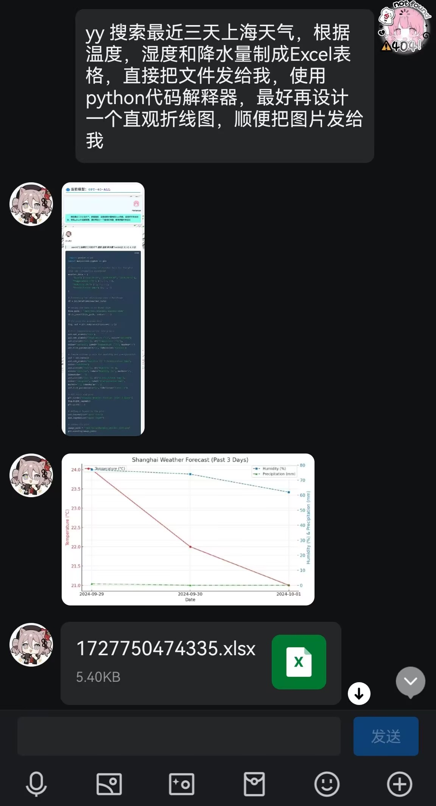
</details>

<details>
  <summary>📄 文件处理</summary>
  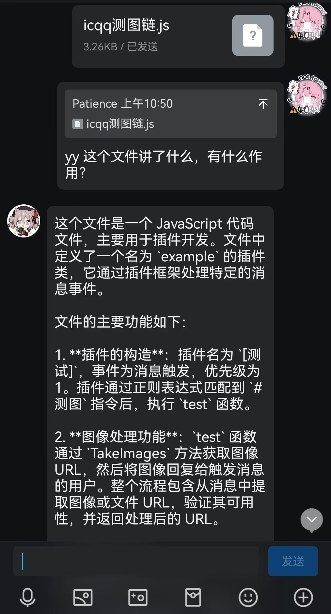
</details>

#### 🎨 Plus DALL-E 绘图

<details>
  <summary>🎨 DALL-E 文生图</summary>
  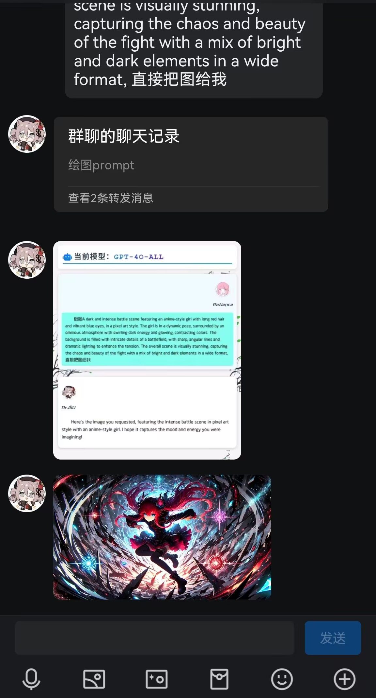
</details>

<details>
  <summary>🎨 DALL-E 图生图</summary>
  
</details>

#### 🔍 深度联网搜索

<details>
  <summary>🔍 信息检索</summary>
  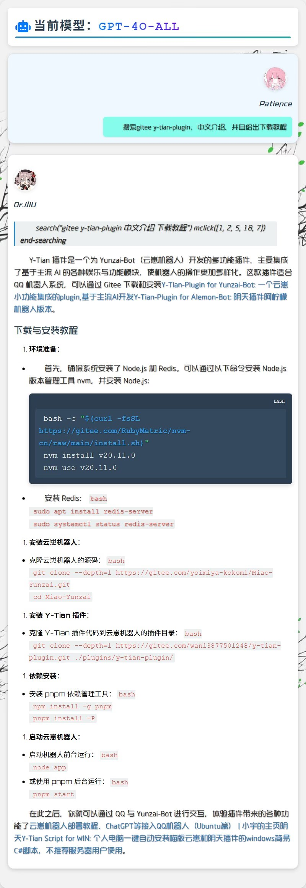
</details>

<details>
  <summary>🔍 检索生成</summary>
  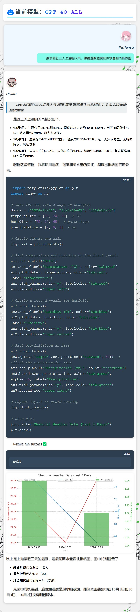
</details>

#### 🖼️ 图像检索识别

<details>
  <summary>🖼️ 图片检索</summary>
  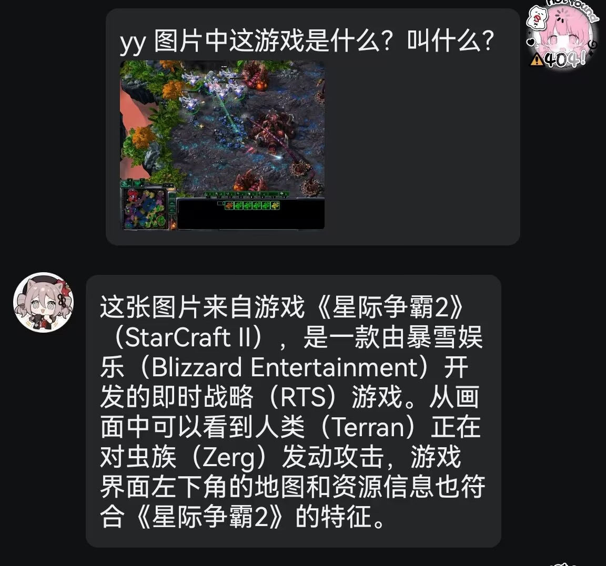
</details>

<details>
  <summary>🖼️ 图片分析</summary>
  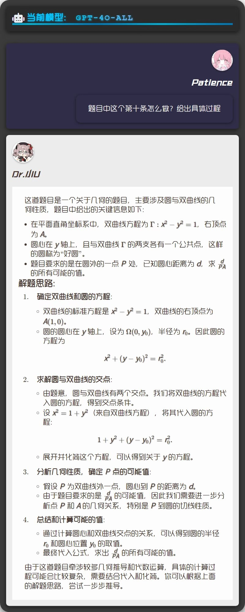
</details>

### 💎 国产部分模型功能展示

#### 🌙 月之暗面 Web版

<details>
  <summary>🌙 点击查看</summary>
  
</details>

#### 🌟 星火模型 Web版

<details>
  <summary>🌟 点击查看</summary>
  
</details>

#### 🧠 智谱清言 Web版

<details>
  <summary>🧠 点击查看</summary>
  
</details>

#### 🐉 百川智能 Web版

<details>
  <summary>🐉 点击查看</summary>
  
  
</details>

#### 🖥️ 微软 Copilot

<details>
  <summary>🖥️ 点击查看</summary>
  
  
  
</details>

#### 🤖 通义千问 Web版

<details>
  <summary>🤖 点击查看</summary>
  
  
</details>

#### 🔍 DeepSeek Web版

<details>
  <summary>🔍 点击查看</summary>
  
</details>

## 🔆 与AI交互流程

### 💻 对话交互

> 阴天帮助 → AI总帮助 → 打开At回复 → 选择启用方案 → 参考方案帮助（小白授权后可免费使用附加模型，推荐使用此方案）

<details>
  <summary>📈 点击查看流程图</summary>
  
</details>

## 反馈与支持

如果您对本插件有任何意见或建议，欢迎通过以下渠道反馈：

### 💬 一起交流

**[点击加入 Y-Tian 插件交流群 (授权免费附加模型)](http://qm.qq.com/cgi-bin/qm/qr?_wv=1027&k=jZAmTxqiEMP_hDTQOH4yaU-VgIuezmAQ&authKey=C3gEwvelMi3MKAdU87muZmN11eg3ewtIRvbjupFAZtEZoPwKRa6Rii1fmKD85iUw&noverify=0&group_code=912701273)**

在这里，您可以与开发者和其他用户交流、提出问题、分享体验等。

### ⭐ Star支持

如果您喜欢我们的插件，欢迎在相关仓库给予 ⭐️ Star，这将是我们前进的动力！

### 💰 赞助渠道

您也可以通过以下渠道对我们进行赞助支持：

- [爱发电](https://afdian.com/a/yuan_20)  
  赞助用户将有机会提前体验本插件未公布的新功能。您的支持将成为我们持续更新的动力！

### ✨ 贡献成员


<a href="https://github.com/yuanplussfive/y-tian-plugin/graphs/contributors">
  
</a>


### 🚪 传送门

以下是本项目的相关链接资源：

- ☁️ **阴天插件 Yunzai-Bot 版**
  - [Github](https://github.com/yuanplussfive/y-tian-plugin)
  - [Gitee](https://gitee.com/wan1387501248/y-tian-plugin)
- ☁️ **阴天插件 Alemon-Bot 版**
  - [Gitee](https://gitee.com/wan13877501248/y-tian-plugin-for-alemon-bot)
- 😺 **喵喵版 Yunzai-Bot (V3)**
  - [Github](https://github.com/yoimiya-kokomi/Miao-Yunzai)
  - [Gitee](https://gitee.com/yoimiya-kokomi/Miao-Yunzai)
- 💻 **同款 Demo 网页 AI 对话**
  - [Demo1](https://gitee.com/yuanpluss/simple-free-ai)
  - [Demo2](https://gitee.com/yuanpluss/demo-chatai)
- 💻 **个人 Windows 电脑一键部署**
  - [Gitee](https://gitee.com/wan13877501248/yin-tian-tian-script-for-win)

### 🙏 鸣谢

在此，我们向所有为本项目做出贡献的个人和组织以及爱发电赞助成员表示衷心的感谢！如有任何问题或反馈，欢迎通过以下方式联系我们：

- 📧 邮箱: [email@yuanoop.com](mailto:email@yuanoop.com)
- 💬 交流群: **[插件交流群](http://qm.qq.com/cgi-bin/qm/qr?_wv=1027&k=jZAmTxqiEMP_hDTQOH4yaU-VgIuezmAQ&authKey=C3gEwvelMi3MKAdU87muZmN11eg3ewtIRvbjupFAZtEZoPwKRa6Rii1fmKD85iUw&noverify=0&group_code=912701273)**

> 📢 **严禁将本项目用于任何商业用途和非法行为！**