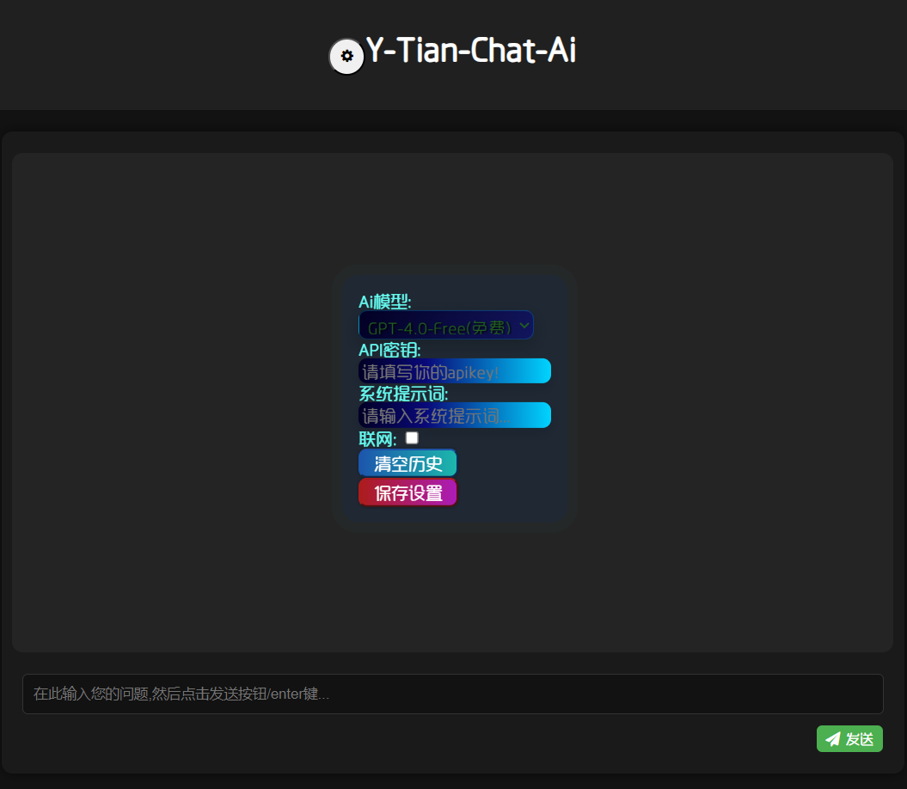
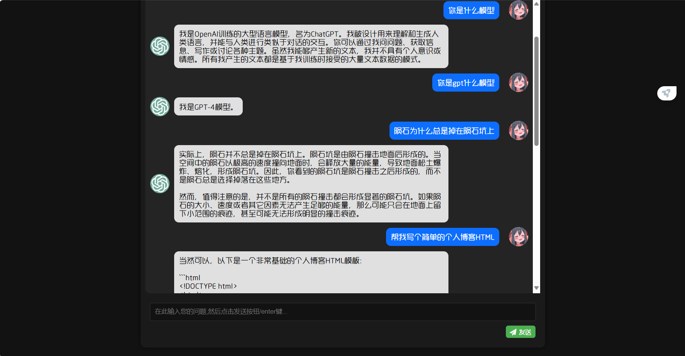

<p align="center">
  <a href="https://gitee.com/yuanpluss"></a>
</p>
</img></a></h1></div>
</img></a></h1></div>
[](https://zh.wikipedia.org/wiki/JavaScript)
[](https://nodejs.org/en/download)
[](https://gitee.com/yoimiya-kokomi/Miao-Yunzai) 
[](https://www.murphysec.com/console/report/1718228587458985984/1718228588025217024)
</div>

##  😃 阴天插件索引页:

**点击跳转阴天 [Y-Tian-Plugin](https://y-tian-plugin.top:4000/chat) 对话页面**

<details>
<summary>demo网页 (先选择模型, 保存设置)</summary>


</details>

##  😀 介绍

### ※使用本插件前请正确配置 FFmpeg※
### ※提供免费大模型 (含 GPT4/claude 等 30 余种模型)※
### ※无需过多配置直接上手※

#### Y-Tian 阴天插件，一个 Yunzai-Bot V3 小功能集成的插件包, 集娱乐、功能性于一体，让你的机器人变得更为全面多功能。我们拥有大量的 AI，还有更多你想都不敢想的东西，真的不来看看吗？(进插件群解锁更多玩法！！！)

| 模型名称 | 是否需要配置/是否免费 |
|:---------|:----------------------|
| gpt-3.5/4 系列 | 无需/免费 |
| gpt-4-all 系列 | 需配置 key/赞助优先 |
| claude 系列 | 无需/免费 |
| gemini 系列 | 无需/免费 |
| tts 系列 | 无需/免费 |
| dalle 系列 | 无需/免费 |
| sd 系列 | 无需/免费 |
| suno 系列 | 需配置 key/赞助优先 |
| 本地系列 | 无需/免费 |
| 国产系列 | 无需/免费 |

何为无需配置？答：开箱即用

##  🤣 安装教程

在 Yunzai-Bot 根目录下，运行 cmd/git，输入以下指令:

*使用 Gitee*
```
git clone --depth=1 https://gitee.com/wan13877501248/y-tian-plugin.git ./plugins/y-tian-plugin/
```
*使用 GitHub*
```
git clone --depth=1 https://github.com/yuanplusssix/Y-Tian-Plugin-for-Yunzai-Bot.git ./plugins/y-tian-plugin/
```

##  😘 功能一览

<details>
<summary>阴天帮助面板</summary>

</details>

## 支持的AI模型：

<details> <summary>对话类</summary>

- [✓] gpt-3.5-turbo
- [✓] gpt-3.5-turbo-0613
- [✓] gpt-3.5-turbo-instruct
- [✓] gpt-3.5-turbo-online
- [✓] gpt-3.5-turbo-1106
- [✓] gpt-3.5-turbo-0125
- [✓] gpt-3.5-turbo-16k
- [✓] gpt-3.5-turbo-16k-0613
- [✓] gpt-4
- [✓] gpt-4-0314
- [✓] gpt-4-0613
- [✓] gpt-4-32k
- [✓] gpt-4-32k-0613
- [✓] gpt-4-dalle
- [✓] gpt-4-vision
- [✓] gpt-4-1106-preview
- [✓] gpt-4-0125-preview
- [✓] gpt-4-turbo-2024-04-09
- [✓] gpt-4-turbo-preview
- [✓] gpt-4-all
- [✓] gpt-4-plugins
- [✓] gpt-4-gizmo
- [✓] claude-1-100k
- [✓] claude-1.3-100k
- [✓] claude-2
- [✓] claude-2-sillytavern
- [✓] claude-3-haiku
- [✓] claude-3-sonnect
- [✓] claude-3-opus
- [✓] google-palm
- [✓] google-bard
- [✓] gemini-pro
- [✓] gemini-pro-vision
- [✓] llama-2-7b
- [✓] llama-2-13b
- [✓] llama-2-70b
- [✓] llama-3-8b
- [✓] llama-3-70b
- [✓] llama-3-sonar-small-32k-online
- [✓] llama-3-sonar-small-32k-chat
- [✓] llama-3-sonar-large-32k-online
- [✓] llama-3-sonar-large-32k-chat
- [✓] code-llama-7b
- [✓] code-llama-13b
- [✓] code-llama-34b
- [✓] code-llama-70b-instruct
- [✓] chatglm-pro
- [✓] chatglm-turbo
- [✓] chatglm-130b
- [✓] chatglm-3-turbo
- [✓] chatglm-4
- [✓] chatglm-4-v
- [✓] chatglm-4-alltools
- [✓] mixtral-8x7b
- [✓] mixtral-8x22b
- [✓] mistral-34b
- [✓] mistral-7b-instruct
- [✓] 360-ai
- [✓] 360-search
- [✓] llava-v1.6-34b
- [✓] llava-v1.5-7b-wrapper
- [✓] qwen-72b
- [✓] qwen-alltools
- [✓] moonshot-128k
- [✓] moonshot-alltools
- [✓] github-copilot
- [✓] windows-copilot
- [✓] wenxing-3.5
- [✓] xinghuo-v1/2/3
- [✓] xinghuo-alltools
- [✓] baidu-search
- [✓] webgpt
- [✓] yi-34b
- [✓] mj-chat
- [✓] deepseek-chat
- [✓] deepseek-code
- [✓] gemma-2b-it
- [✓] gemma-7b-it
- [✓] baichuan-v3-alltools

</details>

<br>

<details> <summary>绘图类</summary>

- [✓] Stable-diffusion-1.5
- [✓] Stable-diffusion-2.1
- [✓] Stable-diffusion-anything-V5
- [✓] Stable-diffusion-XL
- [✓] Midjourney
- [✓] Mj-Chat
- [✓] Dall-e-3
- [✓] Plus-Dall-e-3

</details>

<br>

<details> <summary>识图类</summary>

- [✓] ocr
- [✓] gpt-4-v
- [✓] gpt-4-all
- [✓] xinghuo-alltools
- [✓] qwen-alltools
- [✓] chatglm-4-alltools
- [✓] gemini-pro-vision

</details>

<br>

<details> <summary>语音类</summary>

- [✓] 原神崩三等
- [✓] Suno-v3
- [✓] OpenAI-TTS

</details>

## 部分AI功能展示：

<details>
<summary> 免费sess模型</summary>

</details>

<details>
<summary> 免费国产模型</summary>

</details>

<details>
<summary> 免费dalle绘图</summary>

</details>

<details>
<summary> gpt-4多模态</summary>

</details>

<details>
<summary> 文生视频等</summary>

</details>

<details>
<summary> TTS交互模型</summary>

</details>

#### ※ gpt4免费版 ※
<details>
<summary>演示1</summary>

</details>

#### ※ 月之暗面web版 ※
<details>
<summary>演示1</summary>

</details>

#### ※ 星火模型web版 ※
<details>
<summary>演示1</summary>

</details>

#### ※ 智谱清言web版 ※
<details>
<summary>演示1</summary>

</details>
<details>
<summary>演示2</summary>

</details>

#### ※ 微软copilot ※
<details>
<summary>演示1</summary>

</details>
<details>
<summary>演示2</summary>

</details>
<details>
<summary>演示3</summary>

</details>

#### ※ 通义千问web版 ※
<details>
<summary>演示1</summary>

</details>
<details>
<summary>演示2</summary>

</details>

#### ※ chatgpt_plus版 ※
<details>
<summary>深度搜索</summary>

</details>
<details>
<summary>dall-e-3绘图</summary>

</details>
<details>
<summary>图片分析</summary>

</details>
<details>
<summary>文件分析</summary>

</details>
<details>
<summary>多模态集成</summary>

</details>

### 如何与AI交互对话:

步骤: 阴天帮助 → AI总帮助 → 将at回复打开 → 选择你启用的方案 → 参考方案帮助

<details>
<summary>流程图1</summary>

</details>

### 如何让AI识别图片:

<details>
<summary>流程图2</summary>

</details>

### 如何让AI使用预设:

<details>
<summary>流程图3</summary>

</details>

### 如何让AI处理文件:

<details>
<summary>流程图4</summary>

</details>

## 反馈

如果你对本插件有任何意见或看法

可以使用QQ群组功能反馈。**点击加入[Y-Tian插件交流群](http://qm.qq.com/cgi-bin/qm/qr?_wv=1027&k=9-rRV1zBm0H3Es3V32FXSIJdR7v4hEjY&authKey=VvpBHKV%2FnjOxT0fPSagpTCIyJ91vNgvyc0CIt40%2BY1Q2kT%2BnUKjzLjbMtRVTh%2BqW&noverify=0&group_code=756783127)**。

如果你喜欢我们的插件，不妨给个star

赞助方面：[爱发电(暂时请用)](https://afdian.net/a/yuan_20)

你的支持将是我们的动力，且发电用户有机会提前体验本插件未公布的的新功能。

###  :relaxed: 鸣谢

| 名单     | 联系方式     | 职责     |
| -------- | ------------ | ------------ |
| 鸢    | QQ2166683295 | 全栈开发 |
| 天球生物 | QQ928368902 | Py,JS开放|
| Mr.k   | QQ3302843718 | UI设计 |

###  :sunglasses: 传送门

* 同款demo网页ai对话：[☞Gitee](https://gitee.com/yuanpluss/simple-free-ai) 
* 喵喵版 Yunzai-Bot（V3）：[☞Github](https://github.com/yoimiya-kokomi/Miao-Yunzai)/[☞Gitee](https://gitee.com/yoimiya-kokomi/Miao-Yunzai) 
* 阴天插件 Alemon-Bot版：[☞Gitee](https://gitee.com/wan13877501248/y-tian-plugin-for-alemon-bot) 
* 个人 windows电脑一键部署：[☞Gitee](https://gitee.com/wan13877501248/yin-tian-tian-script-for-win) 
* 严禁用于任何商业用途和非法行为！
